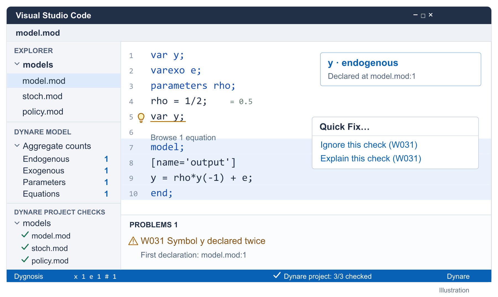
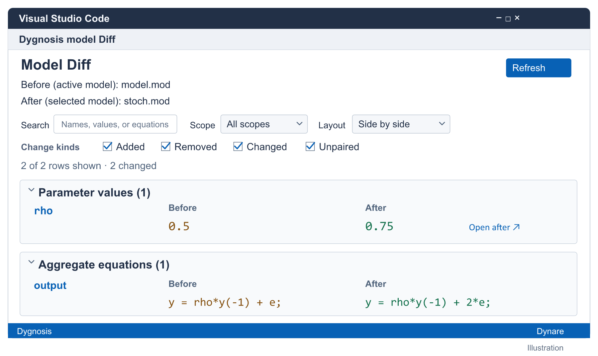
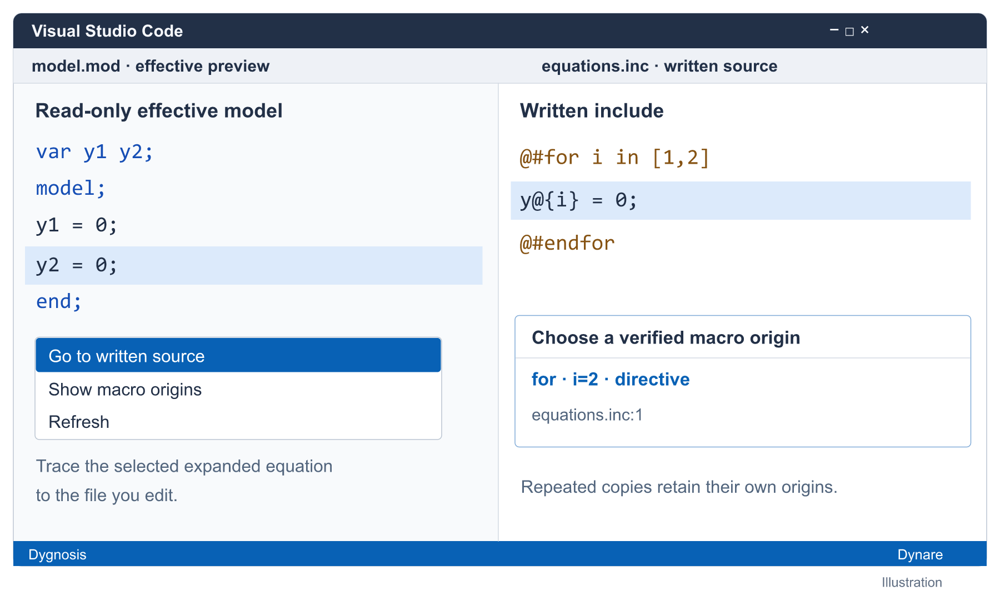

# Dygnosis for VS Code

Dygnosis helps you check and edit Dynare models. Its bundled Rust engine provides live diagnostics, navigation, completion and model facts, and serves the same analysis to agents through MCP. Use official Dynare with MATLAB or Octave for simulation and estimation.

*Illustration: actionable editing and distinct project coverage.*

Open a model or project folder. Browse equations from CodeLens, follow related diagnostics, and use native Problems and Outline. Customize name colors, block tinting and optional value hints in Settings. Background checks cover unopened saved models, with Recheck, cancellation and folder exclusions.

*Illustration: inspect structural changes with **Diff with…**.*

Compare parameters, equations and shock setup, then open either written source.

*Illustration: written-source and macro-origin navigation.*

Trace expanded equations through includes and repeated macros. Refresh after edits for current mappings.

VS Code 1.102+; native Windows, macOS and glibc Linux packages for x64/arm64. See [settings](../../docs/vscode.md), [project MCP setup](../../docs/project-mcp.md), [runtime support](../../docs/distribution.md), [contributing](https://github.com/naivej/dygnosis_dev/blob/main/README.md), and [credits](../../README.md#credits). Based on LLMacro-Dynare-LSP. GPL-3.0-or-later.
