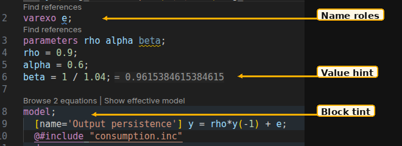

# Dynare colors in VS Code

Open **Dygnosis: Open Settings** and choose **Appearance**. Block backgrounds
follow your theme. `dynare.blockTint.enabled` is the main switch; turning it off
clears backgrounds immediately. Each recognized block category has its own
Off, Subtle, or Model-strength dropdown. Settings reset restores those defaults without restarting the server.



1. **Block tints** color complete written blocks by category and heterogeneity dimension.
2. **Semantic tokens** distinguish endogenous, exogenous, parameter and model-local names.
3. **Expression value hints** show proven top-level assignments such as `beta = 1 / 1.04`.

These settings have resource scope, so a workspace or folder can override your
defaults. An included file uses its own presentation settings and its chosen
model owner. Use **Dygnosis: Choose model owner** when an include has several
owners. Tint covers verified written portions of complete blocks; split include
portions stay separate. Incomplete expansion can retain complete recovered
blocks, so a background does not mean the model is valid or can run.

While you type, the existing background follows your edits. Tint refreshes
after a 200 ms typing pause and stays visible while the new result is pending.
The result replaces the background and removes tint from deleted or unfinished
blocks. You do not need to save for tint or language checks to update.

`dynare.blockTint.heterogeneousModels` overrides the heterogeneous model style
by the dimension name written in the file. Its Settings entry includes
**Edit in settings.json**, also available as **Dygnosis: Edit in settings.json**.
Put this example in User or Workspace settings:

```json
{
  "dynare.blockTint.model.aggregate": "model",
  "dynare.blockTint.model.heterogeneous": "subtle",
  "dynare.blockTint.shocks.surprise": "off",
  "dynare.blockTint.heterogeneousModels": {
    "households": "off",
    "firms": "model"
  }
}
```

The global enabled switch takes priority. Dimension overrides apply only to
heterogeneous model blocks and take priority over their dropdown. A macro loop
can give one written block several dimensions; if their choices disagree, that
shared written portion receives no tint. Invalid styles use the category's
default; invalid dimension entries are ignored with an explanation in
**Dygnosis: Show Output**. An empty override object restores the dropdown's
choice.

Use native `workbench.colorCustomizations` to change background colors and
transparency. The last two hex digits set opacity; `00` is transparent.
Put this example in User or Workspace settings:

```json
{
  "workbench.colorCustomizations": {
    "dynare.blockTint.modelBackground": "#569CD61A",
    "dynare.blockTint.subtleBackground": "#569CD608"
  }
}
```

The contributed colors have separate dark and light defaults. Both
high-contrast defaults are transparent; you can supply your own colors.
Selections, diagnostic marks, and name colors remain native VS Code controls.
See the [VS Code color-customization guide](https://code.visualstudio.com/docs/configure/themes#_workbench-colors).

[Open block tint controls](settings:dynare.blockTint.enabled) · [Open metadata controls](settings:dynare.nameDetails.longName) · [Open value hints](settings:dynare.parameterValueHints)

## Expression value hints

Hints show finite arithmetic values established at top-level assignments in
execution order, including helper names. `beta = 1 / 1.04;` can show its value;
plain numeric assignments stay quiet. Unknown inputs, non-finite arithmetic,
opaque native execution and commands that can change values withhold a hint
until an explicit assignment establishes the value again. Repeated macro sites
need the same value in every occurrence. Incomplete expansion, ambiguous owners
and unverified source positions have no authoritative hint.

Both [parameter value hints](settings:dynare.parameterValueHints) and native
`editor.inlayHints.enabled` control visibility. For Dynare files only, put this
in User or Workspace settings:

```json
{"[dynare]": {"editor.inlayHints.enabled": "off"}}
```

Hiding a hint leaves the engine's hover and comparison facts available.

## Name roles and migration

The grammar colors keywords, comments, strings, and numbers. Semantic tokens
identify names using these independently configurable roles:

| Role | Token selector | TextMate fallback scope |
|---|---|---|
| Endogenous variable | `dynareEndogenous:dynare` | `variable.other.readwrite.dynare.endogenous` |
| Exogenous or deterministic exogenous variable | `dynareExogenous:dynare` | `variable.other.readwrite.dynare.exogenous` |
| Model parameter | `dynareParameter:dynare` | `variable.other.readwrite.dynare.parameter` |
| `#` model-local variable | `dynareModelLocal:dynare` | `variable.other.readwrite.dynare.modelLocal` |

Every role has `variable` as its standard parent. A theme may therefore render
several roles alike. The extension respects native
`editor.semanticHighlighting.enabled`, including its usual
`configuredByTheme` choice; it does not force semantic highlighting or a name
palette. If the theme has no matching semantic rule, the explicit TextMate
scope supplies its fallback. To style a role, put this example in User or Workspace settings:

```json
{
  "editor.semanticTokenColorCustomizations": {
    "rules": {
      "dynareEndogenous:dynare": { "bold": true },
      "dynareExogenous:dynare": { "italic": true },
      "dynareParameter:dynare": { "underline": true },
      "dynareModelLocal:dynare": { "foreground": "#B180D7" }
    }
  }
}
```

Those styles are examples. You can also use the scopes above in native
`editor.tokenColorCustomizations.textMateRules` when customizing the TextMate
fallback. Semantic-token foreground colors do not support transparency.
See [VS Code semantic highlighting](https://code.visualstudio.com/api/language-extensions/semantic-highlight-guide#theming).

Version 0.11 replaces the old Dynare-specific role aliases. Migrate rules that
were intended for one Dynare role as follows:

| Old selector | New selector |
|---|---|
| `variable:dynare` | `dynareEndogenous:dynare` |
| `type:dynare` | `dynareExogenous:dynare` |
| `macro:dynare` | `dynareParameter:dynare` |
| `parameter:dynare` | `dynareModelLocal:dynare` |

A generic `variable` rule can now style all four roles through their parent.
Keep that rule if its broad scope is intended; use a role-specific selector
when you wanted only endogenous variables. Clients that support only standard
LSP token types receive supported `variable` tokens and may render roles alike.
Clients without semantic-token support use their own syntax highlighting.

## Optional timing styles

Dygnosis adds no timing style by default. To distinguish timing through native
semantic-token rules, put your choices in User or Workspace settings, for example:

```json
{
  "editor.semanticTokenColorCustomizations": {
    "rules": {
      "dynareEndogenous.forwardLooking:dynare": { "italic": true },
      "dynareEndogenous.predetermined:dynare": { "underline": true }
    }
  }
}
```

Mixed timing can carry both modifiers. Declaration modifiers keep their
existing meaning. These styles show the engine's model classifications; they
do not provide a solver verdict.
