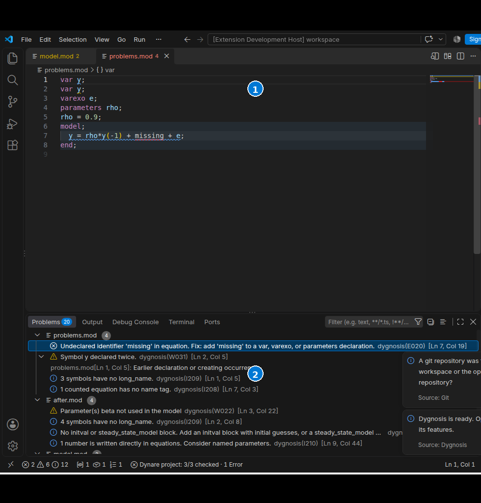

# Diagnostic controls in VS Code

Dygnosis diagnostics appear in the editor and Problems panel. Related locations appear beneath a diagnostic and open the earlier declaration or include site. The extension checks open model roots and their includes. It also checks unopened saved `.mod` roots in workspace folders; see [project checks](project-checks.md). [About Dygnosis](about.md) explains Error, Warning and Information.

Complete files without a `model` block receive the applicable unused-parameter (W022), unused-exogenous (E021), and unused-endogenous (E186) checks. E021 stops the later E186 check. A declaration in an include keeps its diagnostic in that file. An empty aggregate `model; end;` reports E001, `syntax error, unexpected END`, on `end`; it receives no later unused-endogenous check or writing summary. An empty `steady_state_model` also reports E001 on its `end`, unless an earlier Parse error in that block already explains the refusal. Any in-scope Parse error withholds shared Check diagnostics for the analyzed unit, including W022, E021, and W042.

Unused-parameter and exogenous checks do not count terms that Dynare discards while reading equations, such as `0*p`. The editor still shows the written equation and references. W022 counts parameters used or assigned in `steady_state_model`; calibration, initial values, and shock expressions alone do not count as model uses. For a conditional Ramsey steady state, W042 excludes the policy instruments. Discretionary policy alone keeps the missing-assignment warnings.

1. The editor marks the diagnostic range while you edit or after save.
2. **Problems** lists every Dygnosis check with its code, message and source location.

Use the lightbulb or **Quick Fix** on a Dygnosis diagnostic to choose:

- **Ignore this check (code)** hides every diagnostic with that code in this window, including Errors, Warnings, and Information. It also hides fixes attached only to that check. Independent refactors stay available. When a check is selected, Ignore and Explain apply to that check. A request with no selected check can offer them for the current checks that overlap the cursor. A hidden, withdrawn, or foreign diagnostic is not a substitute.
- **Explain this check (code)** opens the engine's explanation in Dygnosis Help. **Dygnosis: Explain a check** in the Command Palette asks for a diagnostic code.

Hiding is temporary display state. It does not edit your `.mod`, change the engine's checks, or affect diagnostics from other extensions. Agent tools still receive all diagnostics. Later diagnostic updates respect the hidden list.

When checks are hidden, a separate status item shows the hidden-code count. Click it, or run **Dygnosis: Show a hidden check**, to restore one code. **Dygnosis: Show all hidden checks** restores all. These commands remain available when diagnostic quick-fix offers are disabled. Restoration replays the latest results or requests fresh results from the engine, preserving related locations and action context. The hidden list clears when workspace folders change, the window reloads, or the extension closes. Restarting the language server keeps the list.

In **Settings → Dygnosis: Diagnostics**, `dynare.diagnosticActions.ignore` and `dynare.diagnosticActions.explain` control the two quick-fix offers. They apply per file or workspace folder and take effect on the next action request without a restart. Reset them through the Settings editor. The hidden-code count is independent of the model-count status item; VS Code's native status-bar menu controls status-item visibility.

Explain opens the exact code in Help and shows the active engine edition. HTML and executable links are removed. If the selected engine cannot explain a code, open the bundled check index in Help and use the engine recovery actions.

[Open the check index](reference.md) · [Diagnostic controls](settings:dynare.diagnosticActions.explain)
