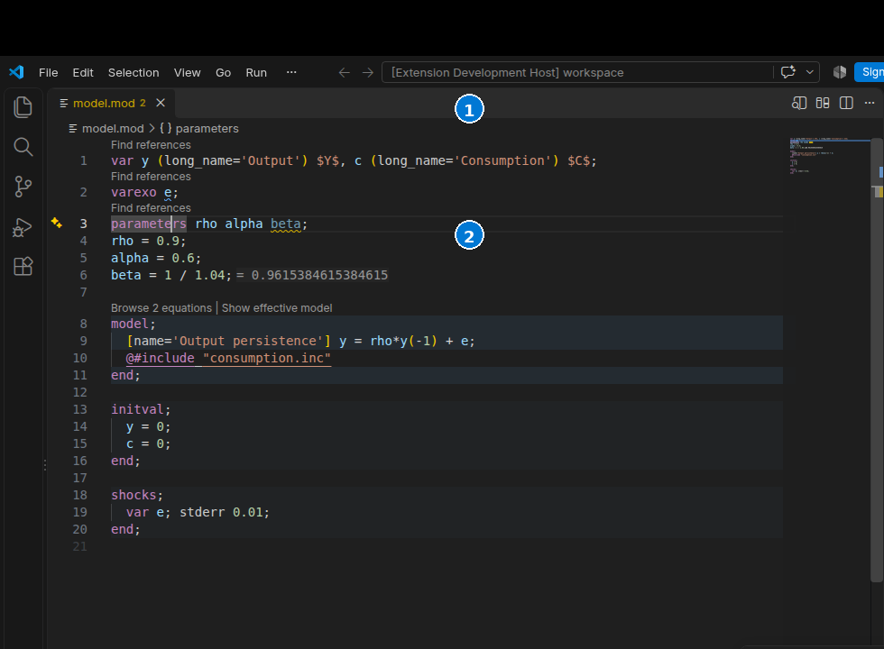

# Edit a model

Open a `.mod` or `.dyn` file and set its language mode to **Dynare**. Dygnosis
checks text as you edit. Open includes through their model root to retain that
model's context. See [model roots and includes](model-and-includes.md).



1. **Hover** shows a declared name's kind, written metadata and proven values where available.
2. **Trigger Suggest** completes names, commands and recognized options with role icons and documentation.

## Names and commands

Hover over a declared name to see its kind and available written metadata.
`long_name` and TeX names remain literal text. Proven parameter values and
timing appear where the engine supplies them. These facts do not establish a
steady state or a numerical solution.

Use **Trigger Suggest** to complete names, commands and recognized command
options. Accepting a name inserts its identifier. The long name is additional
documentation. Command options have their own descriptions; the
[option reference](reference.md) lists the recognized options.

Empty `model`, `steady_state_model`, `initval`, `endval` and `shocks` skeletons
use native snippet placeholders. Press Tab to move between placeholders.
**Trigger Parameter Hints** shows the recognized function or command signature
and the active argument when the engine can identify it.

## Fixes and refactors

Place the cursor on a diagnostic and open **Quick Fix**. Apply only an action
whose proposed edit fits your model. Actions can edit an unopened included
file. VS Code's edit preview shows the affected files. Independent refactors
can remain available when you hide a diagnostic.

The offered diagnostic fixes depend on the source: declare a missing name,
correct a suggested identifier, remove a redundant declaration or repair
statement syntax. The equation-name action on I208 proposes names only for the
equations counted by that note's model block. Its opener can be in the root
while the equations are in an include. Review the proposed files and edits.

**Insert stochastic shocks template** and **Insert deterministic shocks
template** are independent refactors. They insert commented templates for the
available exogenous names when an ordinary shocks block is absent. The model's
simulation commands determine which form is offered; mixed or unspecified
context can offer both. Fill in the template and uncomment it only when it fits
the intended experiment. A changed input invalidates an old diagnostic action.
Request it again from the current text.

## Format and select

Use **Format Document** or **Format Selection**. Formatting changes layout,
not model meaning. [Format indentation](settings:dynare.formatIndent) selects
a tab or 1–8 spaces. For four spaces, put this in User or Workspace settings:

```json
{"dynare.formatIndent": 4}
```

**Expand Selection** uses the language server's nested source ranges. Enable native `editor.linkedEditing` to edit all known occurrences of a declared name in the current document together. At least two source ranges are needed.
An incomplete or unsafe region can have no edit or range; finish the construct
and request the action again. Undo uses VS Code's normal edit history.

[Diagnostic controls](diagnostics.md) explain checks and temporary hiding.
[Appearance](appearance.md) explains metadata and hint visibility.
