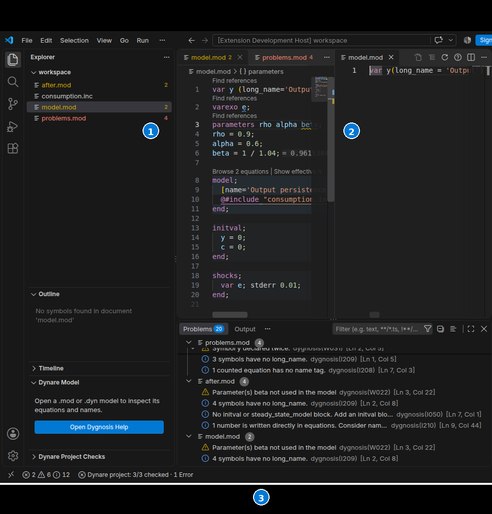

# Trace an effective model

Show effective model opens include and macro expansion in a read-only editor. The preview shows the model before Dynare transforms equations. Edit the written files, then use Refresh effective model to update the preview.

With the bundled engine or an engine that supports source layout, the preview keeps the written spaces and line breaks. Macro substitution and includes expand in place. Strings, native text, and matrix contents stay as written. An older engine that only advertises readable layout keeps the indented preview, which does not preserve written spacing. Engines without either layout keep the compact preview.

Macro interpolation also expands inside quoted values. For example, a loop over `j` with `[name='eq@{j}']` and `long_name='Output @{j}'` produces `eq1`, `eq2`, and their corresponding labels. Each repeated equation keeps its own source and macro origins. A replacement that closes its surrounding quote or adds a line break keeps expansion incomplete; run the official Dynare preprocessor for that case.

1. The written `.mod` file stays editable in the primary editor column.
2. The **effective model** preview shows expanded include and macro text read-only beside it.
3. Native preview commands refresh the text and jump back to verified written locations.

Place the cursor in a mapped model row, or select part of one row. Go to written source opens its verified written portion beside the preview. A row assembled from several files offers a file picker. The picker identifies the model scope and expansion occurrence; repeated macro copies keep their own identity. A selection crossing several rows has no unambiguous jump. Text outside mapped rows has no source action.

Show macro origins offers the row's verified macro directive and body sites. Labels identify the directive kind, file, frame order, and loop variable/value when available. Choosing an item opens that written site. These locations come from the engine's trace; the extension does not infer them from equation numbers or expanded text.

The three commands appear in the Command Palette while a preview is active. [Editor actions](settings:dynare.editorActions) controls preview title and context menus. Default keyboard shortcuts apply only in a preview editor:

| Action | Windows/Linux | macOS |
|---|---|---|
| Go to written source | Ctrl+Alt+G | Cmd+Alt+G |
| Show macro origins | Ctrl+Alt+M | Cmd+Alt+M |
| Refresh effective model | Ctrl+Alt+R | Cmd+Alt+R |

[Keyboard Shortcuts](action:shortcuts) can change these bindings. Pickers use VS Code's native keyboard controls and theme.

Each preview retains its chosen root and input revision. It can refresh after that root closes, and several previews can refer to different roots. Source edits, dependency changes, settings changes, and a language-server restart disable origin actions until Refresh. Open, Refresh, and source jumps use one layout for that engine. Refresh replaces text and navigation together; an older response cannot overwrite a newer request. Refresh does not jump to a location based on the previous cursor mapping.

A missing or changed source cancels a jump. Refresh the preview and choose the row again.

Incomplete expansion is labelled and has no origin actions. An older engine can keep the basic text preview and Refresh while navigation remains unavailable. Unsupported navigation reports an engine-update recovery action. [Integration contracts](integrations.md) describe source ranges and input revisions for other clients.
