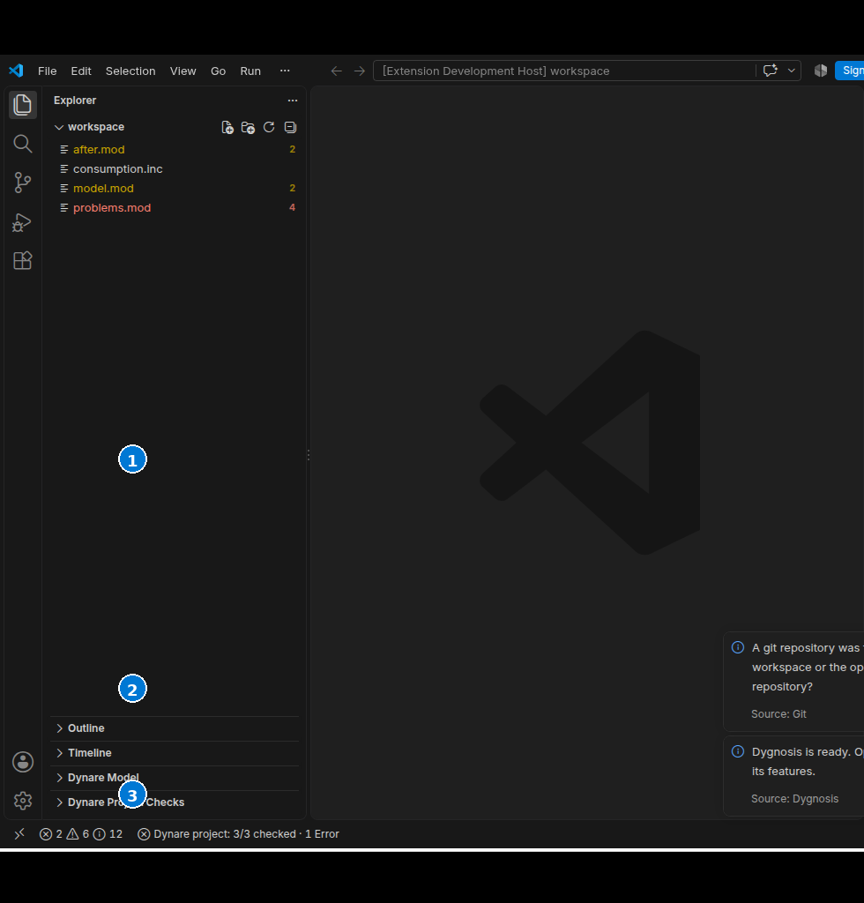

# Get started

Install **Dygnosis** from the
[VS Code Marketplace](https://marketplace.visualstudio.com/items?itemName=dygnosis.dygnosis).
For a candidate build, use **Install from VSIX…** as described below. The
extension includes its Rust engine. Analysis needs no separate Rust,
Python, MATLAB, Octave or Dynare installation. VS Code updates the extension
and its engine together.

## Open your first model

1. Open a folder containing your model, then open its `.mod` or `.dyn` file.
2. Check that the editor's language mode is **Dynare**. `.mod`, `.dyn` and `.inc`
   are associated with that mode. Use **Change Language Mode** if necessary.
3. Read checks in **Problems**, inspect **Dynare model** in Explorer, or use
   **Quick Fix** on a marked problem. [Edit a model](edit-models.md) describes
   completion, formatting and source actions.

**Dygnosis: Open Help** is always in the Command Palette. The question-mark
action on either Dygnosis Explorer view opens it. The first-install invitation
and native **Get started with Dygnosis** walkthrough lead here too. Dismissing
the invitation does not remove these entrances.



1. **Dynare model** shows a welcome row with **Open Dygnosis Help** before any model opens.
2. **Dynare project checks** appears in every workspace folder and links to project-check topics.
3. The first-install notification offers **Open Help** once; dismissal persists for later windows.

Loose and untitled Dynare files receive ordinary editor analysis. Save a model
to establish its disk base for includes. An `.inc` file needs a known model
owner; open its root first. A folder also starts [project checks](project-checks.md)
on unopened saved `.mod` roots.

## Hosts and manual installation

The extension requires **VS Code 1.102.0 or later** and runs in the workspace
extension host. WSL, SSH and container workspaces need the package for that
host. Virtual filesystems have grammar support only. Browser-only, Alpine and
32-bit hosts are outside the package matrix.

| Package target | Verified host for the preceding package series | Engine requirement measured there |
|---|---|---|
| `win32-x64` | Windows Server 2022, build 20348 | Statically linked C runtime |
| `win32-arm64` | Windows 11 ARM, build 26200 | Native ARM64 launch |
| `darwin-x64` | macOS 15 Intel, Darwin 24.6 | Deployment target 13.0 is not a tested minimum |
| `darwin-arm64` | macOS 15 ARM, Darwin 24.6 | Native ARM64 launch |
| `linux-x64` | Ubuntu 22.04 x64 | Highest required glibc symbol 2.34 |
| `linux-arm64` | Ubuntu 22.04 ARM | Highest required glibc symbol 2.34 |

Linux also needs the package's recorded `libgcc_s`, `libm` and loader. VS Code
has its own [host requirements](https://code.visualstudio.com/docs/supporting/requirements).
The table reports tested hosts and measured symbols, not every possible OS.

For manual installation, download `dygnosis-<version>-<target>.vsix` from
[GitHub Releases](https://github.com/naivej/dygnosis/releases). In Extensions,
choose **Install from VSIX…** and select the workspace host's package. Verify
its SHA-256 against `SHA256SUMS` before installation.

## MCP without VS Code

Download the GitHub Release Rust binary archive for your host, verify its
SHA-256 against `SHA256SUMS`, and extract it to a persistent directory. Windows
uses `dygnosis.exe`; macOS and Linux use `dygnosis`. A loose binary asset can
also have its target in its name. Keep the accompanying license and provenance
files. No Node.js or VS Code installation is needed.

Configure your MCP client with separate executable and argument fields:

```json
{
  "mcpServers": {
    "dygnosis": {
      "type": "stdio",
      "command": "/absolute/path/to/dygnosis",
      "args": ["mcp"]
    }
  }
}
```

Use the extracted executable's absolute path on the host running the agent.
The configuration format above is `.mcp.json`; other clients have their own
format. Reconnect the server after replacing the binary. `--version` identifies
it. The binary serves LSP without arguments and MCP with `mcp`.
File checks use editor diagnostics, project checks or `dynare_workspace_diagnose`;
diagnostic explanations use Help or `dynare_explain`.

[Connect an agent](agents.md) covers VS Code's native MCP provider and reviewed
project setup. [Troubleshooting](troubleshoot.md) covers an executable override,
workspace trust and startup recovery. [About](about.md) covers scope and licenses.
