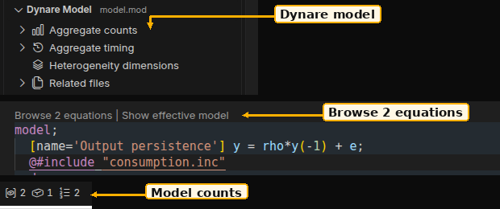

# Model view and equation navigation

Open **Dynare model** in VS Code's Explorer to inspect the selected model's
aggregate counts and timing, each heterogeneity dimension, and related files.
All facts come from the Dygnosis engine. Aggregate counts and dimension counts
stay separate. Expand a timing class to see its variables.

**Static** means no lead or lag; **Predetermined** has lags and no
leads; **Forward-looking** has leads and no lags; **Mixed** has both. These
classes use Dynare's end-of-period convention: a valid
`predetermined_variables k;` converts written `k(+1)` to current `k`, and
written `k` to `k(-1)`, for timing analysis. Static-only replacement rows do
not contribute; heterogeneous model equations keep their written offsets.
Equation text stays as written. An endogenous name with
no equation use also has no lead or lag. The labels do not give a solver result.
Aggregate counts cover the aggregate model; each heterogeneity dimension has
its own declarations, equations and timing lists.



1. **Dynare model** lists aggregate counts, timing classes, dimensions and related files for the selected model.
2. **Browse N equations** and **Show effective model** CodeLens actions appear above mapped model openers.
3. The status bar shows endogenous, exogenous and equation counts for the active `.mod` or `.dyn` file.

Use the view's native title menu to hide or move it. Use
**Dygnosis: Open Settings** and search for `modelView.sections` to choose its
content. The resource-scoped [model view sections](settings:dynare.modelView.sections) control selects the visible sections.

The list order sets the section order. An empty list clears the content.
Preferences apply to the displayed file, so workspace-folder settings can
differ even when two files belong to the same model. Reset the setting through
the Settings editor to restore the defaults.

**Dygnosis: Go to equation N** asks for a positive whole equation number. When
the model contains several equation scopes, choose Aggregate or a heterogeneity
dimension first. **Dygnosis: Jump to named equation** searches names, equation
numbers, scopes, written files, and macro occurrences. Both commands appear in
the Command Palette and the model view's toolbar.

Equation numbers describe surviving counted equations before transformation.
Static-only rows and model locals have no counted number. Dynare's later
transformation can change numbering for MATLAB or Octave. Navigation opens the
engine's verified written source, including equations in included files. A
repeated macro equation has a separate picker entry for each expansion even
when the expansions share a written location. If a location is unavailable,
the command explains that and leaves the editor where it is.

Click a resolved related file to open it with the selected model's owner
context. While focusing an include, the view continues to show that model.
If an include has several known owners, use **Dygnosis: Choose model owner**
to select one explicitly. Open the owner model first when no owner is known.
A `.mod` or `.dyn` opened as an include keeps that owner until you use
**Dygnosis: Treat this file as a model root**.

The view clears outdated rows while refreshing. Incomplete expansion displays
an explanation and withholds counts and equation navigation. Picker actions
recheck the input revision and engine instance after the picker and after
loading the source file. A change of model, active file, owner, or source version
during the jump keeps the editor where it is. If an older engine cannot supply model information, use
**Dygnosis: Restart language server**, inspect **Dygnosis: Show Output**, or
clear `dynare.serverPath` to return to the bundled binary.

## Include lookup

[Additional include directories](settings:dynare.searchPaths) belong to the
model root. Relative entries resolve against its workspace folder, or its
directory for a loose saved file. A displayed include retains that owner's
lookup paths. Untitled files have no disk base. Save the model and resolve
missing includes before using authoritative counts or source jumps.
For a project's `includes` directory, put this in Workspace or Folder settings:

```json
{"dynare.searchPaths": ["includes"]}
```

Companion links can lead to parameter, data or external-function files when
the engine recognizes and resolves them. An unresolved path stays visible as
unresolved; Dygnosis does not create the file or infer numerical data.

Outline, breadcrumbs, quick outline, definition, references, and call hierarchy
use VS Code's native LSP features. Outline shows the current written file's
structure; equation navigation reaches mapped locations across the whole model.
To see equations using a variable, use the native call hierarchy action.

## Model counts and value hints in VS Code

With a `.mod` or `.dyn` active, Dygnosis shows aggregate endogenous, exogenous,
and equation counts in the status bar. Native icons identify the three numbers;
hover for their labels, timing counts, and separate heterogeneity dimensions.
Click the item to focus Outline. VS Code also makes status items available by
keyboard through **Focus Status Bar**.

The counts describe the written model before transformation. Each dimension
has its own count domain; its counts are shown separately in the tooltip.
Timing classes use the timing convention described above. These are model facts, not
solver results. Counts refresh while you edit. Updating, incomplete expansion,
or unavailable model information replaces the numbers until current facts are
available. The bar is hidden on `.inc` files and read-only previews.

Open **Dygnosis: Open Settings**, then use the Model overview controls:

[Open count controls](settings:dynare.statusBar.counts) to choose the visible counts and their order. An empty list hides the bar.

These settings apply immediately and can be overridden per workspace or
folder. They resolve against the displayed file. A `.mod` opened through an
include link keeps its chosen model owner; use **Dygnosis: Treat this file as a
model root** to change that context. Use the setting's gear menu and **Reset
Setting** to restore its default. Invalid stored values are handled safely and
explained in Dygnosis Output.

To keep only equations, put this in User or Workspace settings:

```json
{
  "dynare.statusBar.counts": ["equations"]
}
```

[Expression value hints](appearance.md#expression-value-hints) have separate controls.

## CodeLens in VS Code

**Browse N equations** appears above each safely mapped `model` opener. Choose an equation to open its written source, including equations in an included file. The list shows its name, aggregate or heterogeneity dimension, source file, and Dygnosis equation number before transformation.

The count covers surviving counted equations in that block. Model locals, static-only rows, and removed equations have no active counted number. Replacement equations use their surviving numbers. These counts and numbers describe the written model before Dynare transformation; later transformations can change MATLAB runtime numbering.

Repeated macro executions at one written opener share one lens. **Browse equations (N occurrences)** first asks which block occurrence to use, showing the dimension, macro values, and each occurrence's count. It then lists that occurrence's equations. An incomplete expansion or unsafe source mapping withholds a counted browser. Open an include's model root first; when several known roots own the include, use **Dygnosis: Choose model owner** to choose its context.

Two optional actions are available:

- **Find references** appears at declaration lines. A line declaring several names opens a symbol picker, then native Find All References. Results use the existing language-server name-occurrence search and may include declarations. The lens requests references when clicked and shows no usage count.
- **Show effective model** appears at the first safe model opener. It opens the chosen root's read-only effective preview beside the editor.

Use the native controls for [equation browsing](settings:dynare.codeLens.modelEquations),
[declaration references](settings:dynare.codeLens.declarationReferences) and
[effective preview](settings:dynare.codeLens.effectiveModel) to choose the actions.

All three settings apply to the displayed file and support workspace/folder overrides. Changes apply immediately. Use **Reset Setting** to restore a default. Native `editor.codeLens` controls overall visibility; it also stops this surface's model requests when off. To hide lenses in Dynare files only, put this in User or Workspace settings:

```json
{
  "[dynare]": { "editor.codeLens": false }
}
```

Native commands remain available through the Command Palette and editor menus when lenses are hidden: **Dygnosis: Go to equation N**, **Dygnosis: Jump to named equation**, **Dygnosis: Show effective model**, and **Find All References**. Configure their shortcuts in VS Code's Keyboard Shortcuts editor.

Lenses refresh with edits, include changes, owner choices, and server restarts. A click made from older model data stops and asks you to use the refreshed action. Only verified written locations open; equation text and numbering are never used to guess a source location.
