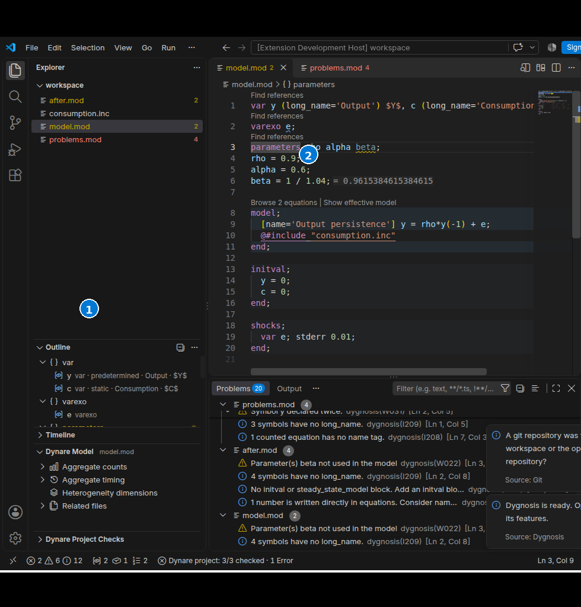

# Navigate code

Use VS Code's native navigation commands on a Dynare name. A model root and its
known includes provide the analysis context. Open the root first when an
include has no known owner; [choose an owner](model-and-includes.md) when it
belongs to several models.

1. **Outline** lists declarations, blocks, commands, dimensions and equations for the written file.
2. The editor keeps the current model open while you browse structure and jump to a selected row.

## Names and uses

**Go to Definition**, **Go to Declaration**, **Go to Type Definition** and
**Peek Definition** open the engine's source target when available. A name can
lead to the same written declaration through these commands. **Find All
References** lists known name occurrences and lets you open each source range.
Document highlights mark occurrences in the current file.

**Rename Symbol** uses the native rename input and edit preview. Review all
changed files before accepting. The new name must be a legal identifier. A
missing name, unsafe source range or changed input can stop the edit. Rename
does not infer aliases hidden in unsupported macro state or MATLAB code.

**Show Call Hierarchy** on a variable shows its equation uses through the native
hierarchy view. These are model dependencies, not a numerical computation.

### Model-local variables

On a model-local use, **Go to Definition** opens the `#name` target for that
model, including in an unopened include. **Go to Declaration** prefers an
explicit `model_local_variable` declaration and otherwise opens the `#` target.
A declaration without a definition has no definition target.

**Find All References** and document highlights use the same local definition
and its bound uses. The explicit declaration and defining target count as
declarations; highlights mark them as writes and the uses as reads. A local
with the same spelling in another model or heterogeneity dimension stays
separate. Local definitions remain in Outline without an equation number.

**Rename Symbol** changes the proven declaration, definition, and bound uses.
The new name must be legal and must not collide with an existing binding.
Rename can be unavailable when an include has incompatible owners, one
explicit declaration serves different local definitions, or macro-generated
text cannot represent the requested edits. Changed inputs also stop the edit.
Finish the construct or choose its model owner, then request rename again.

## File and workspace structure

**Go to Symbol in Editor**, Outline and breadcrumbs show the current written
file. **Go to Symbol in Workspace** searches the engine's known workspace
symbols. Select a row to open its source. Outline can show declarations,
blocks, commands, heterogeneity dimensions and equations. Use
[Outline sections](settings:dynare.outline.sections) to choose their order and
[equation numbers](settings:dynare.outline.equationNumbers) to display verified
Dygnosis numbers.

Use native folding to collapse complete block and macro regions. Unfinished
or unsafe regions can remain unfolded. Native editor and Outline controls
manage visibility, sorting, breadcrumbs and keyboard shortcuts.

For an equation elsewhere in the model, use [equation navigation](model-and-includes.md).
It reaches mapped include sources and distinguishes expanded macro occurrences.
