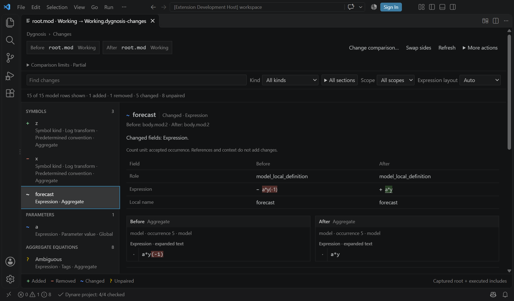

# Semantic model Diff

Open a model and run **Dygnosis: Show mod changes**. The open model is **After**.
Choose its **Before** version:

1. **With previous revision** uses HEAD for a Working model, or the first parent
   of the commit opened in a historical document. The picker names that commit.
2. **With revision…** lists repository commits, offers Load more, and accepts a
   local revision such as `HEAD~2` or a commit hash.
3. **With branch or tag…** selects the fixed commit of a local branch,
   remote-tracking branch, or tag.
4. **With .mod file…** selects another current `.mod` or `.dyn` model.

**Working** means current saved files plus open unsaved text. A historical model
uses its root and active includes from the selected commit. The four choices
keep the invoking model version as After, even when HEAD is elsewhere. On an
include, choose its model owner when asked. An unknown historical owner is
checked at that same commit. The Source Control action uses its selected
Working model, including when invoked from the staged list.

Git choices remain visible when unavailable and explain the reason. File
comparison stays available. **Show mod changes with .mod file…** is the direct
file-comparison command for existing bindings. Cancelling a picker keeps the
current comparison.

The comparison opens as a pinned tab in the active editor group. The top bar
keeps Before and After together. Use **More actions** for Root file text diff,
Captured file text diff, Update revision, Details, Help and Expansion. Details
shows the full captured input paths and include settings.

The Changes tab names both inputs. **Change comparison…** chooses another
baseline for the original open model. **Swap sides** exchanges Before and After,
including the direction of Added and Removed. **Refresh** keeps selected commits
fixed; **Update revision** resolves their requested refs again. Git reads do not
fetch, check out files, or change the index. Missing local objects require the
user to obtain them before retrying. A missing root offers **Choose model path**;
an established rename needs a path choice before it is used.

For history comparisons, both sides use the launching model's current
[extra include folders](settings:dynare.searchPaths). Details shows the captured
folders. Each historical side uses its own written `@#includepath` and macros.
Historical settings files are not applied automatically. Active historical
includes outside the repository, through symlinks, or across submodules cannot
be compared. A model rooted inside a checked-out submodule uses its own
repository. File comparisons use each current root's own include settings.

## Review the model

The Changes view opens on **Model changes**. It compares retained model facts
across supported parser families, including symbols, parameters, equations,
priors, commands and other accepted settings. One changed fact has one model
row. Supporting statement context and equation references do not add more model
changes. Model counts describe displayed row appearances.

A compact grouped list shows the model changes beside the selected detail.
Each split keeps its own filters, selection, expression layout and expansion
state while sharing the captured comparison.
The change-color legend stays at the bottom while the review content scrolls.

Missing and explicitly empty field values have blank Before or After cells.
Unknown values say **Unknown**; zero displays as **0**. Equation expressions highlight changed identifiers, timing
suffixes, operators and constants while keeping unchanged context readable.
Timing shows written offsets and, where `predetermined_variables` applies,
offsets after convention conversion. Details can list direct written references
to changed symbols and parameters, including references in unchanged equations.
References are not claims about indirect dependencies or numerical effects.
Equations with the same name can pair when their unchanged regime tags identify
one variant on each side. This includes an OccBin equation's `bind` or `relax`
tag, even when its expression changes. Repeated copies with the same name and
regime stay separate when their correspondence is uncertain.
Uncertain occurrences remain separate and are labeled Unpaired; text-only
highlights do not imply that two equations were paired. The comparison does not
solve the model or report simulation, estimation or steady-state results.

Find changes, Kind, Section and Scope filter model rows. The Section menu has
checkboxes for multiple sections. **All sections** selects or clears them all;
its mixed check means only some sections are selected. Kind offers All or one
choice, plus a saved group of choices. **Expression layout** supports Auto, Side by side and Stacked for
Before and After expression panels. It appears when the selected row has
expression detail; field tables keep their Before and After columns. When no
model row is available, review Comparison limits and the native text diff
before concluding that the written files are unchanged.

**Open source** opens the row's verified written source on that side. Direct
reference actions open the referenced equation. Several contributing files
offer a source picker; an absent or unverified target has a disabled action
and a reason. Historical sources are read-only and retain their commit and
captured text after the Changes tab closes.

## Text diff and comparison limits

**Captured file text diff…** in More actions opens a native picker of changed
captured files, then VS Code's text diff for that file. It uses retained Before
and After text, including unsaved text and executed includes. Added or removed
files compare with an empty side. Uncertain file correspondence stays separate;
the picker does not guess renames. The action stays available when hunk alignment
reaches its limit and complete captured text is retained.

**Root file text diff** opens the native text diff for the selected roots. An
include-only edit may have no root-file hunk. Captured text is read-only;
ordinary Open source actions navigate to verified written files.

**Comparison limits** is a collapsed note below the inputs. Its summary marks
partial comparisons. Open it to see unavailable facts, comparison limits and
the captured source boundary. Relevant limits also appear in row detail. A
limit on one field does not hide other available facts. A field whose comparison
is unavailable stays plain and is not presented as a change.

Only captured roots and executed includes are in the text comparison.
Unexecuted child files, external MATLAB functions and data-file contents are
not captured. Supplied-text inputs contain only the supplied roots and include
text. Empty model rows do not establish that all source text is unchanged.

## Refresh and settings

A change to a Working root, active include, missing candidate or relevant
include setting marks the comparison **Out of date**. Rows remain visible, but
source actions are disabled until Refresh captures current inputs. Source
actions also check that their retained target still belongs to the current
capture. Unrelated edits do not invalidate it. Two fixed historical inputs
remain current across Working edits. An engine restart requires a new capture.
An incomplete or failed refresh clears authoritative comparison rows.

[Expression layout](settings:dynare.diff.layout) keeps Auto, Side by side and
Stacked.
Changing `dynare.diff.sections` updates open comparisons. Other defaults apply
when opening a comparison. Display choices survive Refresh and window reload;
restored inputs are captured again before source actions become available.
Missing repositories, commits and untitled inputs have an explicit failure
state. History comparison requires snapshot support in the engine; an older
engine can still support current-file comparison.
