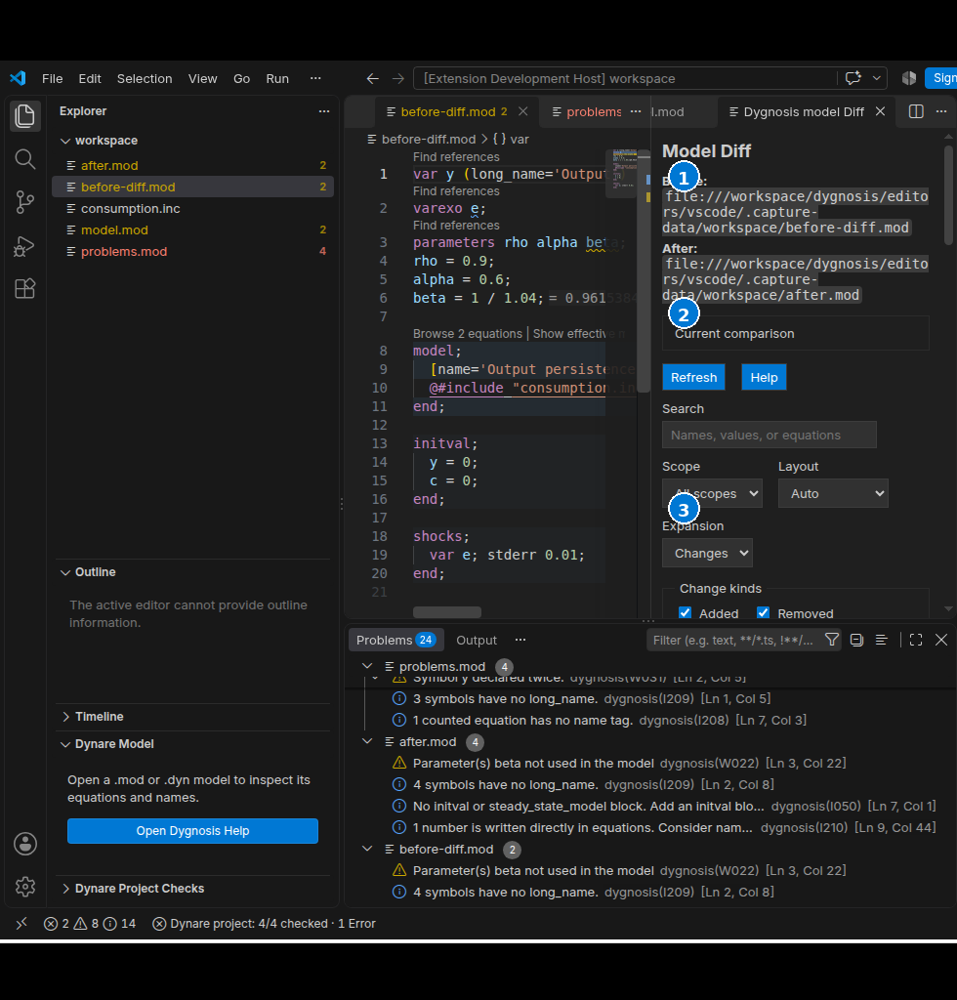

# Structural model Diff

Open a model and run **Dygnosis: Diff with…**. On an include, choose its known
model owner when asked. A native file dialog chooses the second `.mod` or `.dyn`.
The active model root is **Before**; the selected model is **After**. The view
shows the engine's structural changes, including current unsaved text and each
model's own include-path settings.

1. **Before** and **After** name the compared model roots at the top of the view.
2. **Search**, **Scope**, **Layout** and **Expansion** narrow the displayed rows.
3. **Change kinds** and **Sections** choose which structural differences appear.

The view separates symbols, parameter values, aggregate equations, equations by
heterogeneity dimension, shock setup, and shock analysis setup. The engine's
paired changes retain Before and After values. Unpaired rows stay separate;
they may also appear in the engine's added or removed lists. Counts describe
displayed row appearances, including those distinct unpaired appearances.

Use Search, Scope, Change kinds, or Sections to narrow the rows. Layout offers
Auto, Side by side, and Stacked; Auto stacks the two sides in a narrow view.
Section headers expand or collapse with the mouse or keyboard. Expansion sets
all sections to Changes, All, or None. Since this view contains changed rows,
Changes and All open the same nonempty groups. Refresh and hiding/reopening the
same comparison retain its choices.

**Open source** uses only verified written targets supplied for that row and
side. A row spanning several files offers a native source picker. Absent sides
and unavailable mappings have a disabled action with a reason. After either
model, a dependency, settings, or the engine changes, the view says **Out of
date** and disables source actions. Refresh recomputes the comparison. The
client checks both input revisions and the exact row targets again before
revealing a source document.

No-change, incomplete expansion, and failed comparison states are explicit.
An incomplete or failed refresh clears prior rows. An engine override without
navigation schema 1 cannot provide this view. A failed or unsupported comparison
offers native **Show Output**, **Open Settings**, and **Use bundled binary**
actions to help recover.

[Diff controls](settings:dynare.diff.layout) use Before's model context for new-view defaults. They change presentation only. Changing `dynare.diff.sections` updates the sections in open views, including
when a hidden tab returns. Other defaults
apply when opening a new comparison. Per-view choices do not change engine or
MCP data. Native VS Code controls manage the tab's placement and visibility.
