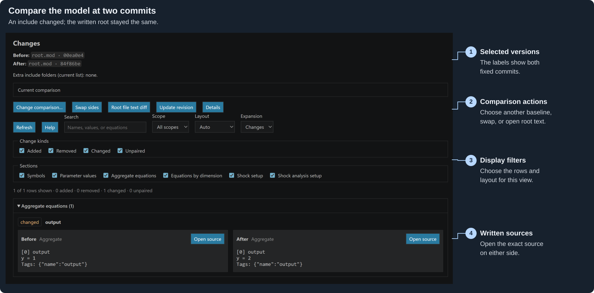

# Structural model Diff

Open a model and run **Dygnosis: Open changes**. The open model is **After**.
Choose its **Before** version:

1. **With previous revision** uses HEAD for a Working model, or the first parent
   of the commit opened in a historical document. The picker names that commit.
2. **With revision…** lists repository commits, offers Load more, and accepts a
   local revision such as `HEAD~2` or a commit hash.
3. **With branch or tag…** selects the fixed commit of a local branch,
   remote-tracking branch, or tag.
4. **With .mod file…** selects another current `.mod` or `.dyn` model.

**Working** means current saved files plus open unsaved text. A historical model
uses its root and active includes from the selected commit. The four choices
keep the invoking model version as After, even when HEAD is elsewhere. On an
include, choose its model owner when asked. An unknown historical owner is
checked at that same commit. The Source Control action uses its selected
Working model, including when invoked from the staged list.

Git choices remain visible when unavailable and explain the reason. File
comparison stays available. **Open changes with .mod file…** is the direct
file-comparison command for existing bindings. Cancelling a picker keeps the
current comparison.

The Changes tab names both inputs. **Change comparison…** chooses another
baseline for the original open model. **Swap sides** exchanges Before and After,
including the direction of Added and Removed. **Refresh** keeps selected commits
fixed; **Update revision** resolves their requested refs again. Git reads do not
fetch, check out files, or change the index. Missing local objects require the
user to obtain them before retrying. A missing root offers **Choose model path**;
an established rename needs a path choice before it is used.

For history comparisons, both sides use the launching model's current
[extra include folders](settings:dynare.searchPaths). Details shows the captured
folders. Each historical side uses its own written `@#includepath` and macros.
Historical settings files are not applied automatically. Active historical
includes outside the repository, through symlinks, or across submodules cannot
be compared. A model rooted inside a checked-out submodule uses its own
repository. File comparisons use each current root's own include settings.

The view separates symbols, parameter values, aggregate equations, equations by
heterogeneity dimension, shock setup, and shock analysis setup. Paired rows keep
Before and After values. Unpaired rows stay separate; counts describe displayed
row appearances. Search, Scope, Change kinds and Sections filter rows. Layout
supports Auto, Side by side and Stacked. Section headers and Expansion control
which groups open. Each split has its own filters; splits share the same
captured comparison. These choices do not edit or save a model.

**Open source** opens the row's verified written source on that side. Historical
sources are read-only, show the commit in their tab name, and keep their exact
captured text after the Changes tab closes. A row with several contributing
files offers a source picker. Absent or unmapped sources have a disabled action
with a reason. **Root file text diff** opens VS Code's native text diff for the
two written roots. An include-only change has no root-file text hunk.

A change to a Working root, active include, missing candidate, or relevant
include setting marks the comparison **Out of date**. Rows remain visible, but
source actions require Refresh. Unrelated edits do not invalidate it. Two fixed
historical inputs remain current across Working edits. An engine restart
requires a new capture. Incomplete or failed refreshes clear authoritative rows.
**No structural changes** states that written text can still differ; filters
that hide existing rows have their own message.

[Diff controls](settings:dynare.diff.layout) use the launching model context for
new-view defaults. Changing `dynare.diff.sections` updates open comparisons.
Other defaults apply when opening a comparison. Display choices survive Refresh
and window reload; restored inputs are captured again before source actions
become available. Missing repositories, commits and untitled inputs have an
explicit failure state. History comparison requires snapshot support in the
engine; an older engine can still support current-file comparison.
