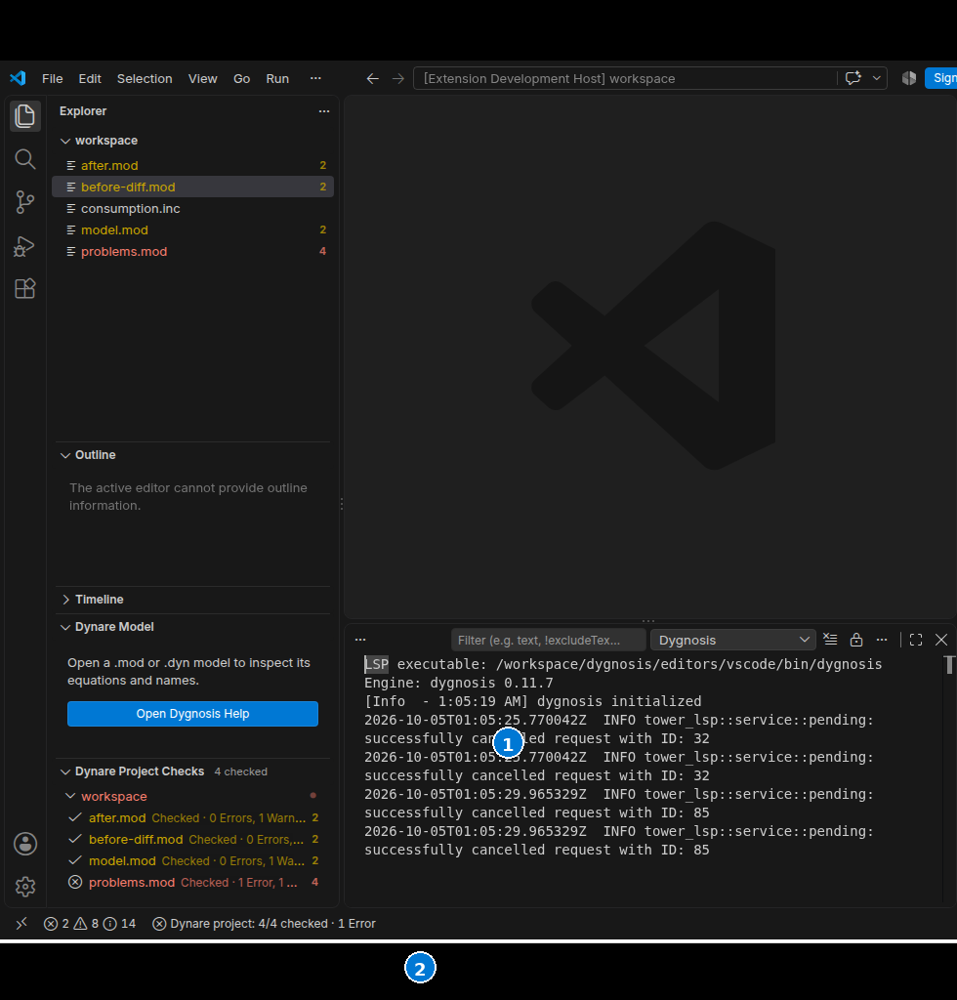

# Resolve a problem

Open [Dygnosis Output](action:output) for the failure details. Help remains
available without an open model or a working engine.

1. **Dygnosis** Output records startup, engine selection and recovery messages.
2. The **Dynare project** status item stays visible while you restart the language server or clear an override.

## The engine does not start

The extension includes the native engine for its workspace host. Reinstall the
matching extension package if that binary is absent or damaged. A remote
workspace runs it on the remote host. Use a supported host from
[Get started](get-started.md).

An absolute User or machine [server path](settings:dynare.serverPath) selects
another executable for LSP and VS Code MCP. Clear it to use the included
engine, then [restart the language server](action:restart). Workspace settings
cannot select an executable in an untrusted workspace. Never select MATLAB,
Octave or the official Dynare preprocessor as this server.

An older engine can lack a requested capability. Update the selected binary or
use the included one. An unsupported schema is not treated as a compatible
result. A missing explanation can still be read from this Help edition's
[check index](reference.md).

## A feature has no result

| Visible state | What to do |
|---|---|
| No model root / no owner | Open the owner `.mod` or `.dyn`; choose its owner for an include. |
| Updating / out of date / changed input | Wait for current model data, or refresh the preview or comparison. Request a picker action again. |
| Incomplete expansion | Resolve the include or macro problem. Counts and verified source jumps are withheld when they cannot be established. |
| No counted or named equations | Check the chosen scope. Model locals and static-only rows have no counted number. |
| No verified written location | Edit the written files directly; the engine does not guess a location from text. |
| No changes | The structural comparison found no displayed change. This is not numerical equivalence. |
| Pending / failed project root | Open the project view and Output. Resolve read/discovery failures and Recheck. |
| No folders / no root models | Open a file-backed workspace folder with saved `.mod` roots. |
| Off / excluded | Change the project controls. Opening a model still gives editor checks. |
| Missing hint, color, lens or row | Check the feature's Dygnosis setting and its native editor visibility control. Reset a setting to its default if needed. |

Virtual filesystems have grammar support only. Untitled Dynare documents can
receive analysis but have no disk base for includes. Save the root to a
file-backed folder for disk includes and project checks. `.inc` needs a known
model owner. Check the language-mode control if a file is treated as plain text.

## Project MCP setup fails

Use a trusted file-backed workspace and follow [Connect an agent](agents.md).
Resolve invalid or duplicate JSON keys, unsupported config shape and symlinks
before setup. Changed disk or editor text requires a fresh review. A locked
managed binary can wait until the other agent stops its server. The agent owns
its tool approval and reconnect controls.

## Report a problem

Include the extension and active engine versions, host OS/architecture, whether
the workspace is remote, the command used, and relevant Output. Give the
smallest shareable `.mod` and include files that show the problem. State the
expected and observed result. Review logs and model text before sharing them.
[Open the issue tracker](https://github.com/naivej/dygnosis/issues).
